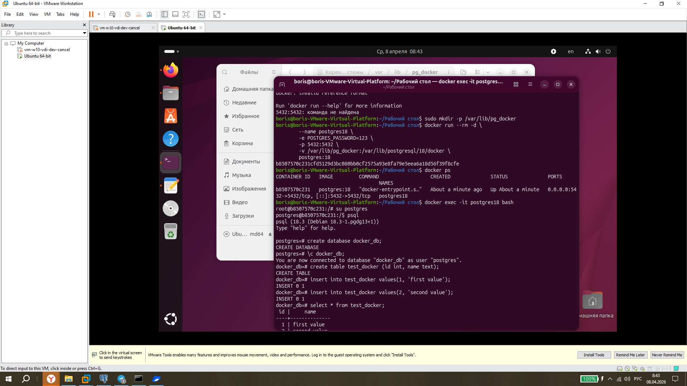

# ДЗ № 1. Установка Postgres
## Подготовка ВМ
Мною для работы была взята виртуальная машина на VMware workstaation, на которую я установил OS линукс ubuntu версии 25.10.
На неё с посошью командс терминала был установлен Docker:
```bash
sudo 
```

Затем
