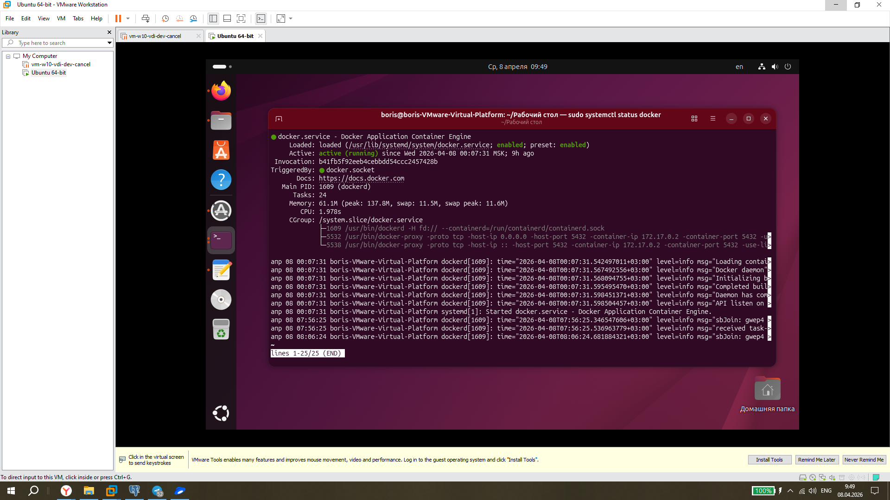
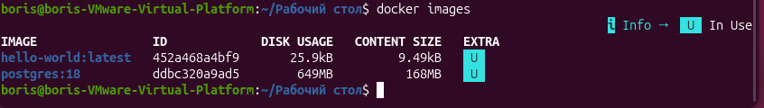

# ДЗ № 1. Установка Postgres
## Подготовка ВМ
Мною для работы была взята виртуальная машина на VMware workstaation, на которую я установил OS линукс ubuntu версии 25.10.
На неё с посошью командс терминала был установлен Docker:
```bash
# Add Docker's official GPG key:
sudo apt update
sudo apt install ca-certificates curl
sudo install -m 0755 -d /etc/apt/keyrings
sudo curl -fsSL https://download.docker.com/linux/ubuntu/gpg -o /etc/apt/keyrings/docker.asc
sudo chmod a+r /etc/apt/keyrings/docker.asc

# Add the repository to Apt sources:
sudo tee /etc/apt/sources.list.d/docker.sources <<EOF
Types: deb
URIs: https://download.docker.com/linux/ubuntu
Suites: $(. /etc/os-release && echo "${UBUNTU_CODENAME:-$VERSION_CODENAME}")
Components: stable
Architectures: $(dpkg --print-architecture)
Signed-By: /etc/apt/keyrings/docker.asc
EOF

sudo apt update

sudo apt install docker-ce docker-ce-cli containerd.io docker-buildx-plugin docker-compose-plugin

sudo systemctl status docker
```


Затем с сайта https://hub.docker.com был скачан образ postgres:18 (18-й версии):
```bash
--# добавлили себя в группу docker, чтобы не прописывать sudo в каждой команде
sudo usermod -aG docker $USER
newgrp docker

docker search postgres

docker pull postgres:18

docker images
```


