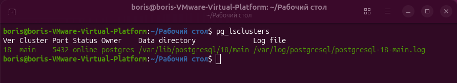
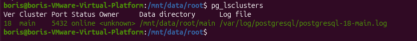
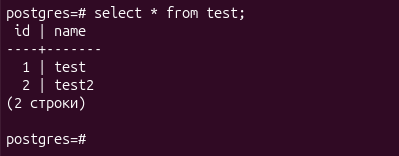

# ДЗ № 2. Физический уровень PostgresSQL
## Установка PostgresSQL
Устанавливаем postgresql 18, создаём таблицу test и добавляем туда 2 записи:
```bash
create table test (id int, name text);
insert into test_docker values(1, 'test');
insert into test_docker values(2, 'test2');
```
## Монтируем новый диск
### 1 Создаём образ на 2 Гб
```bash
cd /mnt/data
sudo fallocate -l 2G mydisk.img
```
### 2. Размечаем его
```bash
sudo echo -e ",200M,U\n,+\n" | sudo sfdisk -X gpt mydisk.img
```
### 3. Подключаем через kpartx
```bash
sudo kpartx -av mydisk.img
```
### 4. Форматируем на 2 раздела
```bash
sudo mkfs.fat -F32 /dev/mapper/loop18p1
sudo mkfs.ext4 /dev/mapper/loop18p2
```
### 5. Монтируем и копируем
```bash
sudo mkdir -p /mnt/data/{esp,root}
sudo mount /dev/mapper/loop18p1 /mnt/data/esp
sudo mount /dev/mapper/loop18p2 /mnt/data/root
```
### 6. Автомонтирование
```bash
# узнаем uuid дисков
sudo blkid /dev/mapper/loop18p1
#UUID=0800-A000
sudo blkid /dev/mapper/loop18p2
#UUID="4c2f594b-6d3e-4247-9969-4b0099f3c190"

# пропишем их в fstab
sudo nano /etc/fstab
#UUID=0800-A000 /mnt/data/esp -F32 defaults 0 2
#UUID=4c2f594b-6d3e-4247-9969-4b0099f3c190 /mnt/data/root ext4 defaults 0 2
```
### 7. Проверим конфигурацию (не должно быть ошибок)
```bash
sudo mount -a
```
### 8. Назначим владельца папки
```bash
sudo chown postgres /mnt/data/root
```
### 10. Посмотрим статус кластеров
```bash
pg_lsclusters
```


### 9. Войдём в psql под пользователем postgres
```bash
sudo su postgres
psql
```
### 10. Создадим табличное пространство на смонтированном диске
```bash
create tablespace my_ts location '/mnt/data/root';
```
### 11. Остановим кластер
```bash
sudo pg_ctlcluster 18 main stop
```
### 12. Перенесём папку с данными кластера на новый диск
```bash
sudo su postgres
mv /var/lib/postgresql/18/main /mnt/data/root
```
### 13. Запускаем кластер (не стартует)
```bash
su boris
sudo pg_ctlcluster 18 main start
#Error: /var/lib/postgresql/18/main is not accessible or does not exist
```
### 14. Меняем путь к данным в файле /etc/postgresql/18/main/postgresql.conf
```bash
data_directory = '/mnt/data/root/main'
```
### 15. Запускаем кластер (стартует)
```bash
sudo pg_cluster 18 main start
```

### 16. Смотрим табличку
```bash
sudo su postgres
psql
```
```sql
select * from test;
```

### 17. Отключаем диск
```bash
sudo pg_ctlcluster 18 main stop
sudo umount /mnt/data/esp /mnt/data/root
sudo kpartx -dv mydisk.img
```
