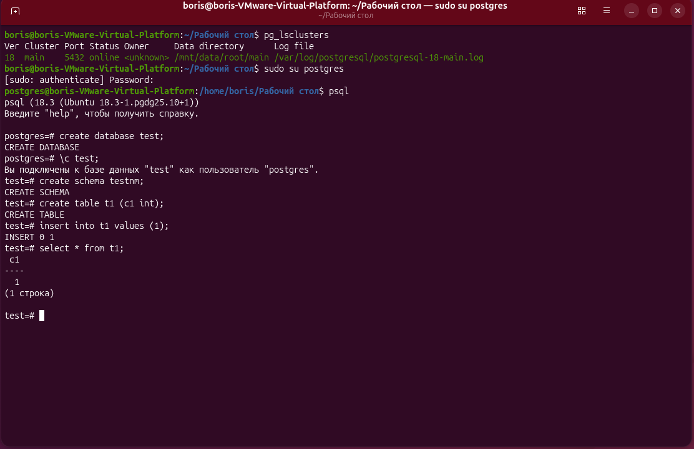
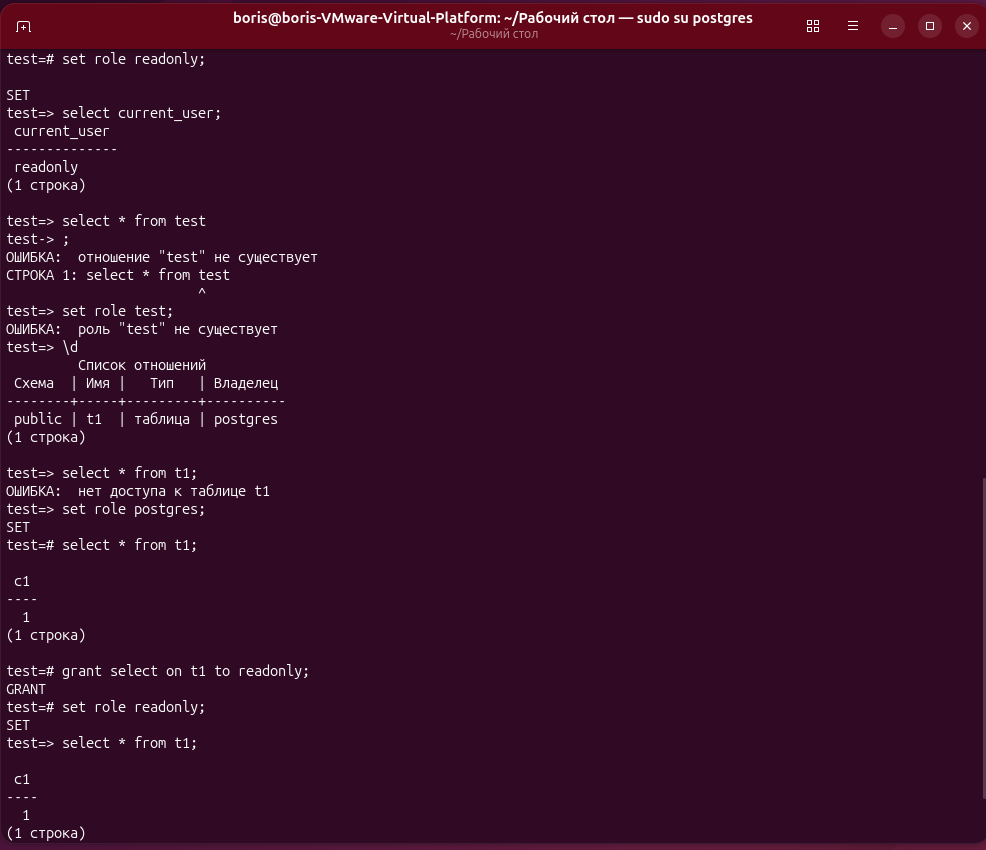
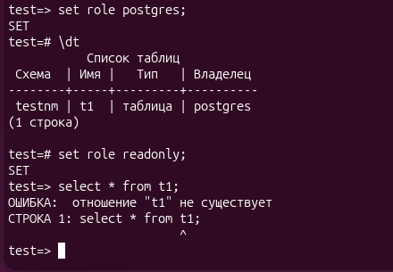
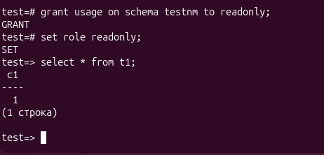

# ДЗ № 2. Логический уровень PostgresSQL
Смотрим на кластеры в postgres
```bash
pg_lsclusters
```
Заходим в postgres
```bash
sudo su postgres
psql
```
Создаём БД test
```bash
create database test;
\c test;
```
Создаём схему и таблицу
```sql
create schema testnm;
create table t1 (c1 int);
```
Добавим строку
```sql
insert into t1 values (1);
```
Посмотрим таблицу
```sql
select * from t1;
```

Создадим роль readonly с подключением к БД
```sql
create role readonly login;
```
Подключимся под этим пользователем, но доступа к таблице нет!
```sql
set role readonly;
select * from t1;
```
Вернёмся к пользователю postgres и выдадим права на чтение таблицы t1
```sql
set role postgres;
grant select on t1 to readonly;
```
Проверим доступ к таблице t1
set role readonly;
select * from t1;

Это всё было в сехеме public. Теперь удалим таблицу t1 и создадим её в схеме testnm.
```sql
drop table t1;
create table testnm.t1 (c1 int);
```
Добавим строку
```sql
insert into testnm.t1 values (1);
```
Посмотрим таблицу
select * from testnm.t1;
```
Дадим права на неё
```sql
grant select on testnm.t1 to readonly;
```
и проверим доступ к ней (а таблица не видна)
```sql
set role readonly;
select * from testnm.t1;
```

Потому что нет прав на схему - выдадим эти права
```sql
grant usage on schema testnm to readonly;
```
и проверим доступ к т аблице
```sql
set role readonly;
select * from t1;
```

