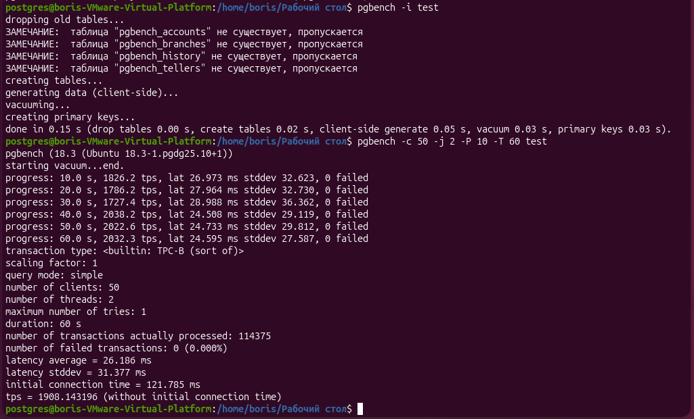
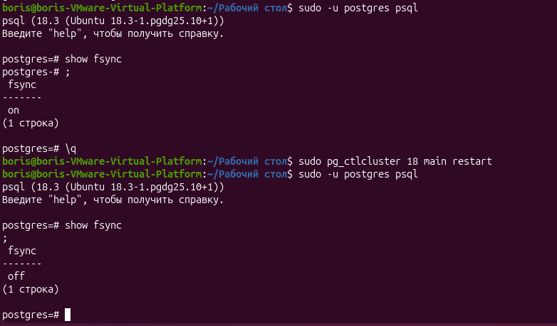
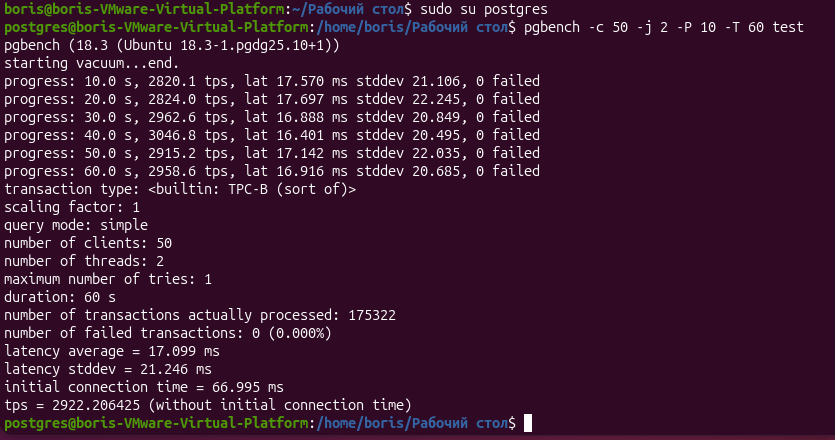

# ДЗ № 4. Логический уровень PostgresSQL
Заходим в базу
```bash
sudo su postgres
psql
```
создаём БД test
```bash
create database test
```
Выходим в линукс и инициализируем pgbench
pgbench -i test
```bash
pgbench -i test
```
Запускаем тестирование
```bash
pgbench -c 50 -j 2 -P 10 -T 60 test
```


Отключимм параметр fsync в файле /mnt/data/root/main/postgresql.auto.conf (добавим в файде строку):
fsync=off
Перезапустим кластер:
```bash
sudo pg_ctlcluster 18 main restart
```
Проверим параметр fsync
```bash
sudo -u postgres psql
show fsync
```


Запускаем повторное тестирование
```bash
sudo su postgres
pgbench -c 50 -j 2 -P 10 -T 60 test
```


Число транзакций увеличилось более, чем на тысячу в секунду!

