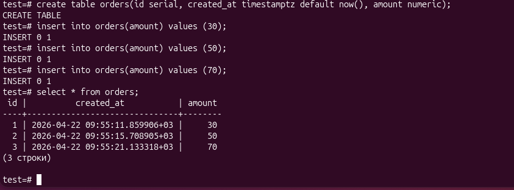
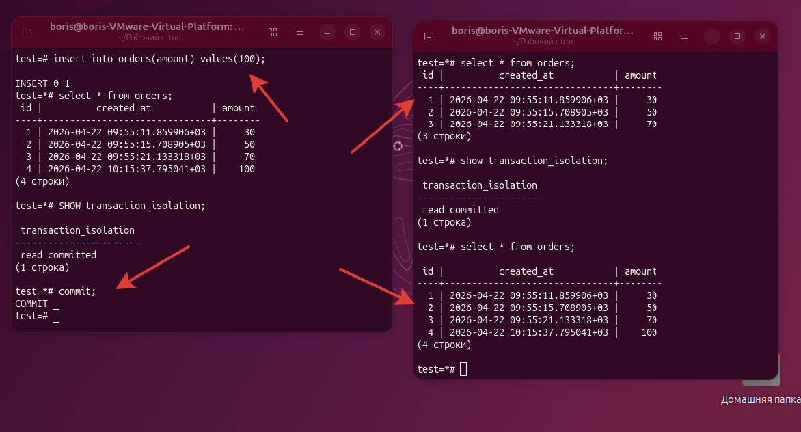
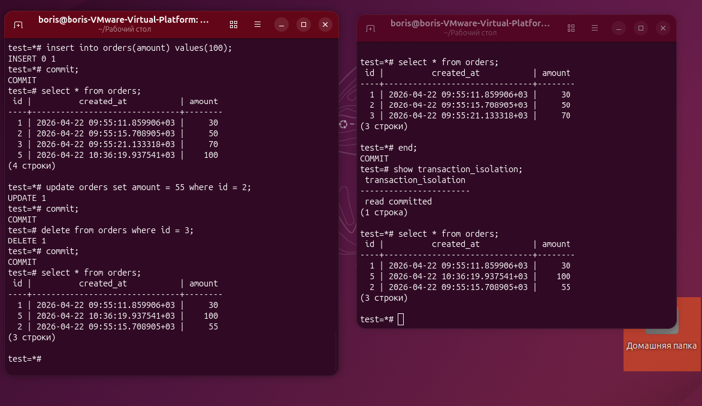

# ДЗ № 5. Изоляция транзакций
Заходим в базу postgres
```bash
sudo su postgres
psql
```
Создаём таблицу в БД test с 3 записями
```bash
\c test;
create table orders(id serial, created_at timestamptz, amount numeric);
insert into orders(amount) values (30);
insert into orders(amount) values (50);
insert into orders(amount) values (70);
select * from orders;
```


Выключим AUTOCOMMIT и добавим 4-ю строку (текущий уровень изоляции транзакции - read commited):
```bash
\set AUTOCOMMIT off
insert into orders(amount) values (100);

select * from orders;
SHOW transaction_isolation;
```
Видим 4 строки, а во второй транзакции только 3 строки (без commit а первой)
```bash
select * from orders;
SHOW transaction_isolation;
```
Зафиксируем изменения в первой транзакции
```bash
commit;
```
Видим 4 строки во второй транзакции
```bash
select * from orders;
```


Включим во второй транзакции уровень изоляции Serializable:
```bash
set transaction isolation level Serializable;
```
Удалим 3ю и 4ю строку, изменим вторую, добавим 5ю в первой транзакции с commit'ом:
```bash
delete from orders where id = 3;
commit;
delete from orders where id = 4;
commit;
update orders set amount = 55 where id = 2;
commit;
insert into orders(amount) values (100);
select * from orders;
```

```bash
Вторая сессия не видит этих изменений даже с оператором commit  в первой транзакции:
select * from orders;
```
Завершим тразакцию. Теперь изменения видны:
```bash
end;
select * from orders;
```
(рис.3)

