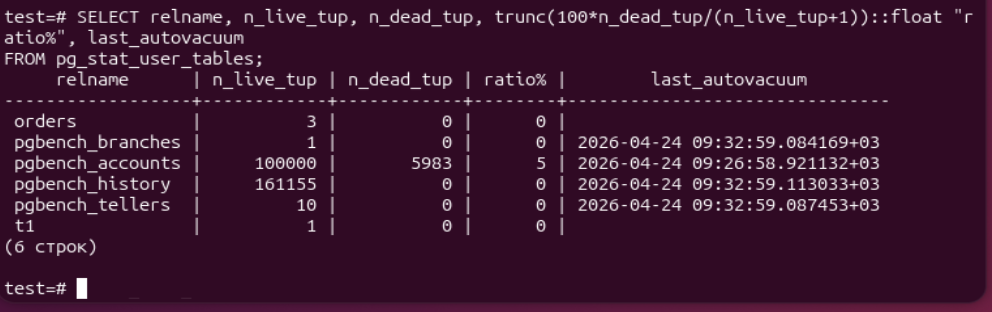
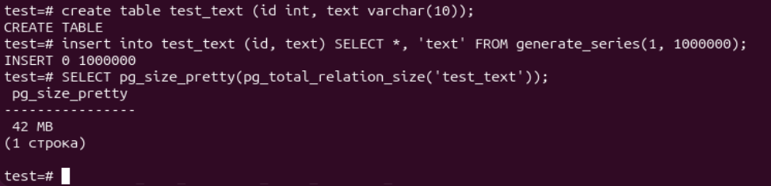

# ДЗ № 6. MVCC, vacuum и autovacuum
Подготовим тестовые таблицы
```bash
pgbench -c8 -P 6 -T 60 -U postgres test
```
Запустим нагрузку
```bash
pgbench -c8 -P 6 -T 60 -U postgres test
```

Заходим в базу postgres
```bash
sudo su postgres
psql
```

Посмотрим на статистику таблиц после нагрузки
```bash
SELECT relname, n_live_tup, n_dead_tup, trunc(100*n_dead_tup/(n_live_tup+1))::float "ratio%", last_autovacuum 
FROM pg_stat_user_tables;
```


Создадим таблицу и заполним её миллионом строк
```bash
create table test_text (id int, text varchar(10));
insert into test_text (id, text) SELECT *, 'text' FROM generate_series(1, 1000000);
```


