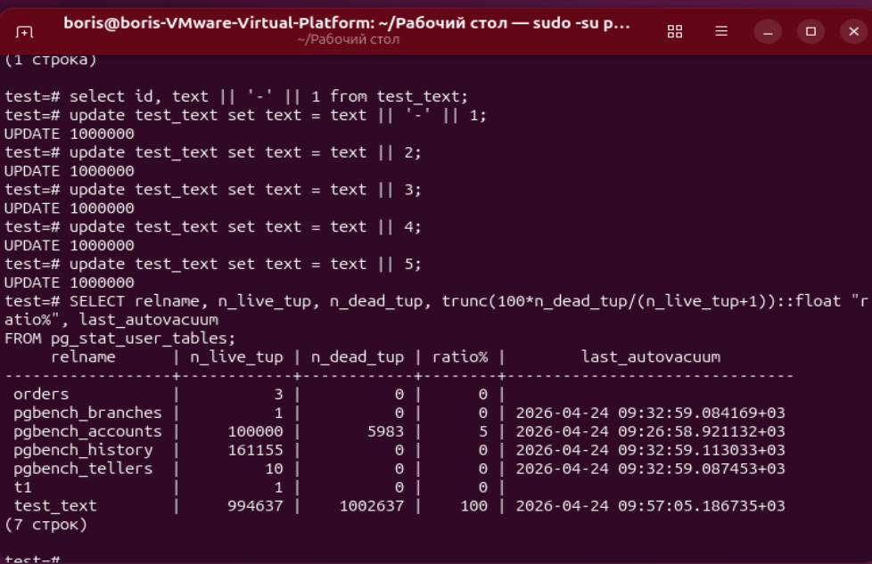
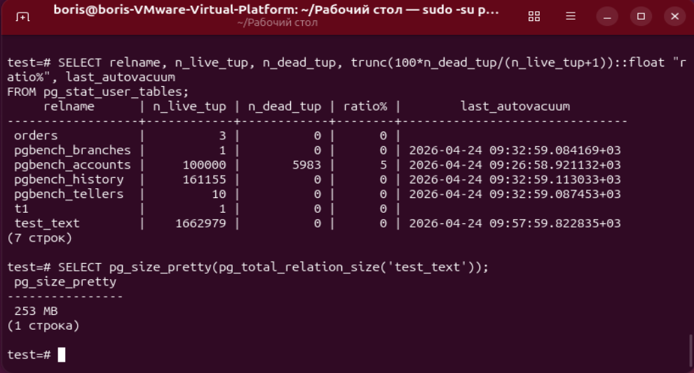
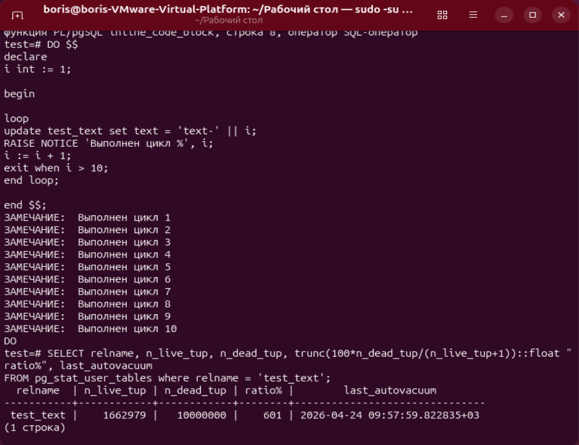
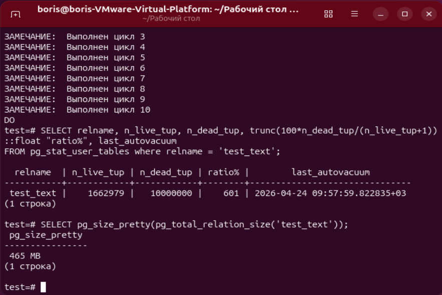
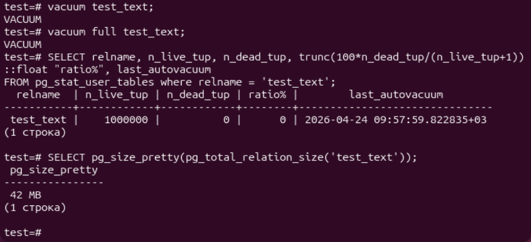

# ДЗ № 6. MVCC, vacuum и autovacuum
Подготовим тестовые таблицы
```bash
pgbench -c8 -P 6 -T 60 -U postgres test
```
Запустим нагрузку
```bash
pgbench -c8 -P 6 -T 60 -U postgres test
```

Заходим в базу postgres
```bash
sudo su postgres
psql
```

Посмотрим на статистику таблиц после нагрузки
```bash
SELECT relname, n_live_tup, n_dead_tup, trunc(100*n_dead_tup/(n_live_tup+1))::float "ratio%", last_autovacuum 
FROM pg_stat_user_tables;
```


Создадим таблицу и заполним её миллионом строк
```bash
create table test_text (id int, text varchar(10));
insert into test_text (id, text) SELECT *, 'text' FROM generate_series(1, 1000000);
```


Обновим все строки 5 раз:
```bash
update test_text set text = text || '-' || 1;
update test_text set text = text || 2;
update test_text set text = text || 3;
update test_text set text = text || 4;
update test_text set text = text || 5;
```
В статистике таблицы test_text - 100% обновление строк:



После срабатывания autovacuum количество мёртвых строк = 0,
а размер файла таблицы всё равно остался в 6 раз больше оригинала, потому что не вызывался vacuum full:
```bash
SELECT pg_size_pretty(pg_total_relation_size('student'));
```



Здесь мы также видим, что в таблице pgbench_accounts остались 5983 строк, помеченных к удалению,
но это всего лишь 5% от общего числа, что меньше настроеченого параметра в 20%, поэтому autovacuum оставил таблицу без обработки.

Теперь отключим autovacuum на нашу таблицу
```bash
ALTER TABLE test_text SET (autovacuum_enabled = on);
```

Выполним анонимный блок изменения всех записей в цикле 10 раз:
```bash
DO $$
declare
i int := 1;

begin

loop
update test_text set text = 'text-' || i;
RAISE NOTICE 'Выполнен цикл %', i;
i := i + 1;
exit when i > 10;
end loop;

end $$;

SELECT relname, n_live_tup, n_dead_tup, trunc(100*n_dead_tup/(n_live_tup+1))::float "ratio%", last_autovacuum 
FROM pg_stat_user_tables where relname = 'test_text';
```

Количество мёртвых строк - 10 млн, а вот % 601



Размер файла таблицы вырос до 465 Мб.
```bash
SELECT pg_size_pretty(pg_total_relation_size('test_text'));
```



Очистим таблицу.
```bash
vacuum test_text;
vacuum full test_text;
SELECT relname, n_live_tup, n_dead_tup, trunc(100*n_dead_tup/(n_live_tup+1))::float "ratio%", last_autovacuum 
FROM pg_stat_user_tables where relname = 'test_text';
SELECT pg_size_pretty(pg_total_relation_size('test_text'));
```


