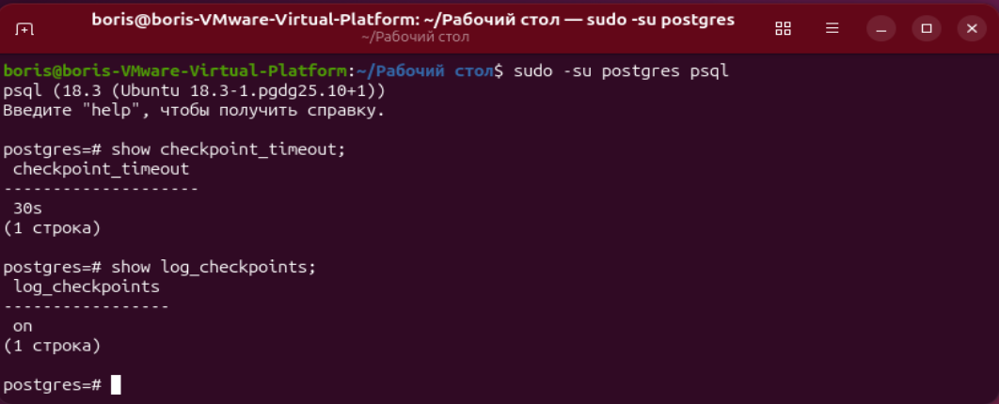
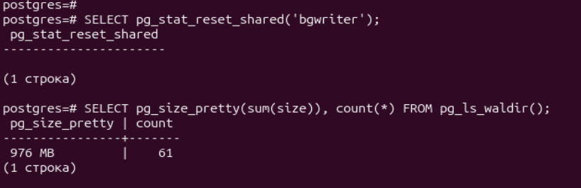
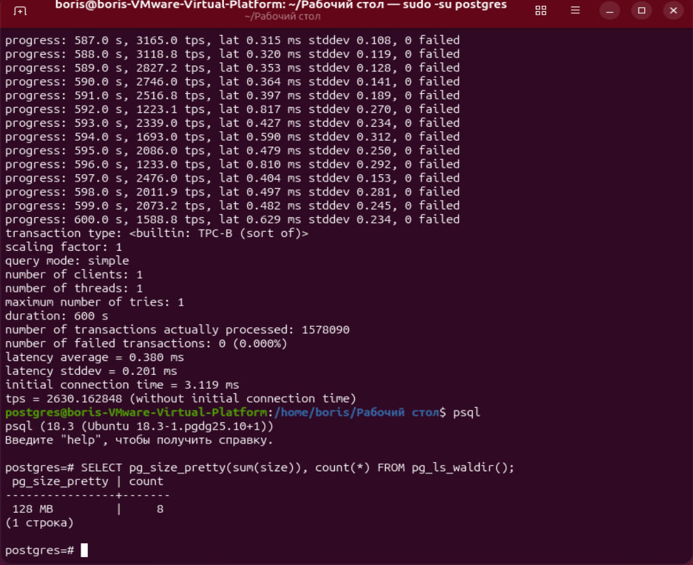
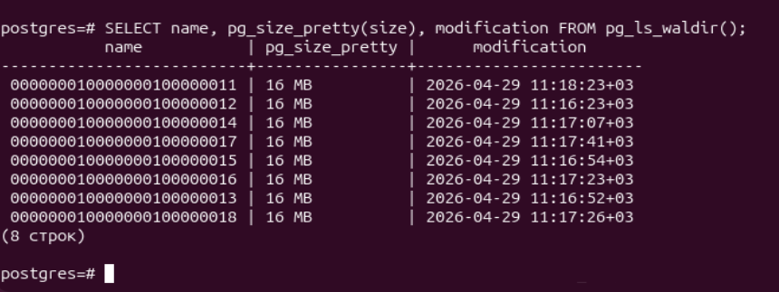
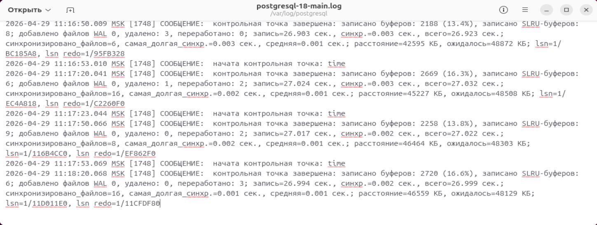
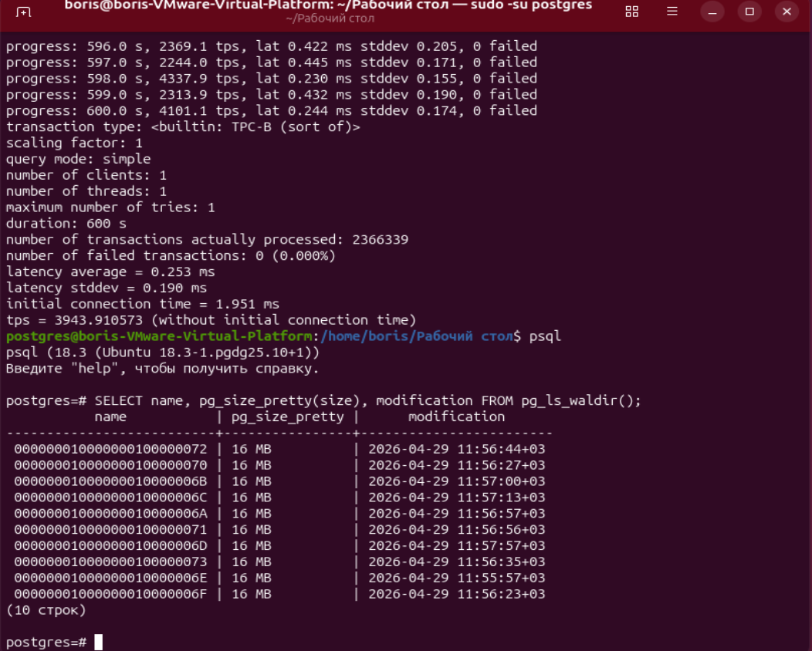

# ДЗ № 7. Журналы
Зададим строку в файле /etc/postgresql/18/main/postgresql.conf:
```bash
checkpoint_timeout = 30s
```

Перезапустим кластер
```bash
sudo pg_ctlcluster 18 main restart
```

Зайдём в postgres и посмотрим параметры checkpoint_timeout и log_checkpoints
```bash
sudo -su postgres psql
show checkpoint_timeout;
show log_checkpoints;
```


Сброс статистики:
```bash
SELECT pg_stat_reset_shared('bgwriter');
```

Размер wal журналов и их количество:
```bash
SELECT pg_size_pretty(sum(size)), count(*) FROM pg_ls_waldir();
```



Попробуем нагрузочное тестирование в синхронном и асинхронном режиме
```bash
pgbench -i test
pgbench -P 1 -T 600 test
sudo -su postgres psql
SELECT pg_size_pretty(sum(size)), count(*) FROM pg_ls_waldir();
```



Количество журналов уменьшилось
SELECT name, pg_size_pretty(size), modification FROM pg_ls_waldir();


В логе видим запуск контрольных точек:


Установим асинхронный режим commit:
```bash
ALTER SYSTEM SET synchronous_commit = off;
```

Перезапустим кластер
```bash
sudo pg_ctlcluster 18 main reload
```

Запустим тестирование
```bash
pgbench -P 1 -T 600 test
```


tps заментно увеличилось (до 3 раз).
Количество журналов тоже увеличилось.
