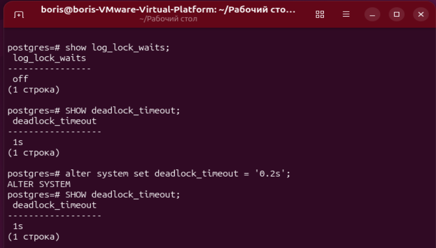
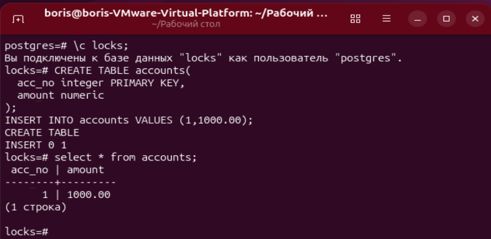
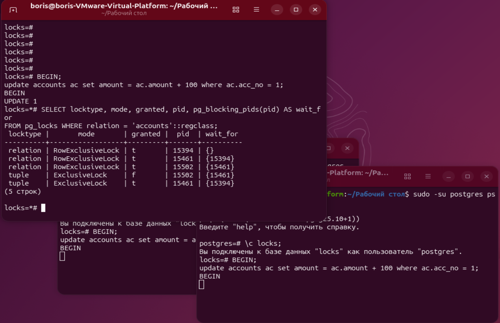
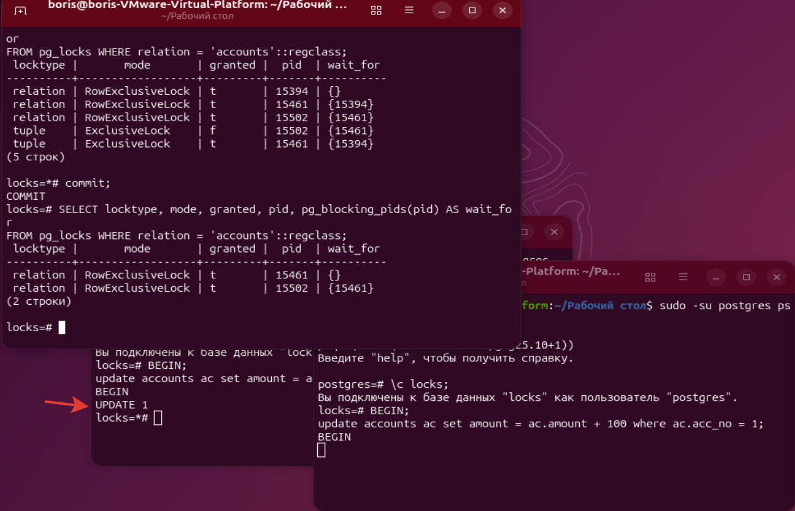
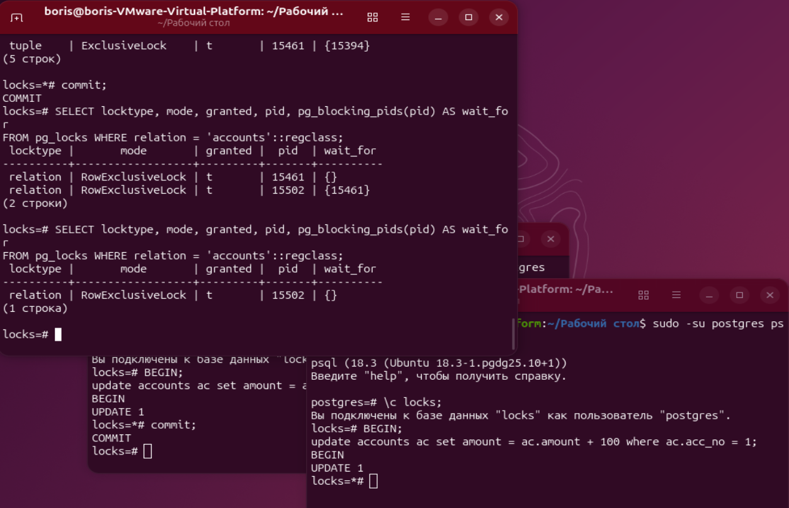
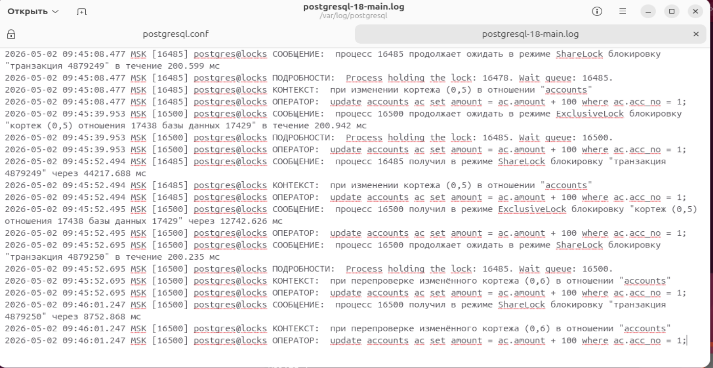
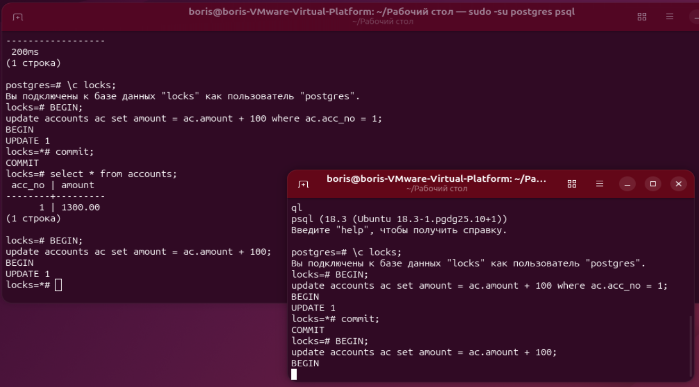

# ДЗ № 8. Блокировки

Зададим параметры логирования блокировок:
```bash
ALTER SYSTEM SET log_lock_waits = on;
ALTER SYSTEM SET deadlock_timeout = '0.2s';
```



Создадим БД, таблицу и строку:
```bash
create database locks;
\c: locks;
CREATE TABLE accounts(
  acc_no integer PRIMARY KEY,
  amount numeric
);
INSERT INTO accounts VALUES (1,1000.00);
```



Запустим 3 сессии с обновлением 1 строки без commit и посмотрим на блокировки:
```bash
BEGIN;
update accounts ac set amount = ac.amount + 100 where ac.acc_no = 1;

SELECT locktype, mode, granted, pid, pg_blocking_pids(pid) AS wait_for
FROM pg_locks WHERE relation = 'accounts'::regclass;
```



Видим блокировки сессий.
После commit'а в первой транзакции вторая сессия провела update,
но третья ещё ожидает окончание транзкции второй сессии:



После commit'а во второй транзакции третья сессия провела update,
блокировок уже нет, то третья транзкция пока не завершена:



Посмотрим сообщения в логе /var/log/postgresql/postgresql-18-main.log:



Тут достаточно подробно описано - кто кого ожидает, в каком режиме блокировки, при каких запросах и на каких таблицах.

Про вопрос в п. 9 можно ответить утвердительно, если 2 сессии при таком update будут выполнять обновление уже изменённых строк в другой сессии.
Воспроизведём это:

```bash
BEGIN;
update accounts ac set amount = ac.amount + 100;
```


