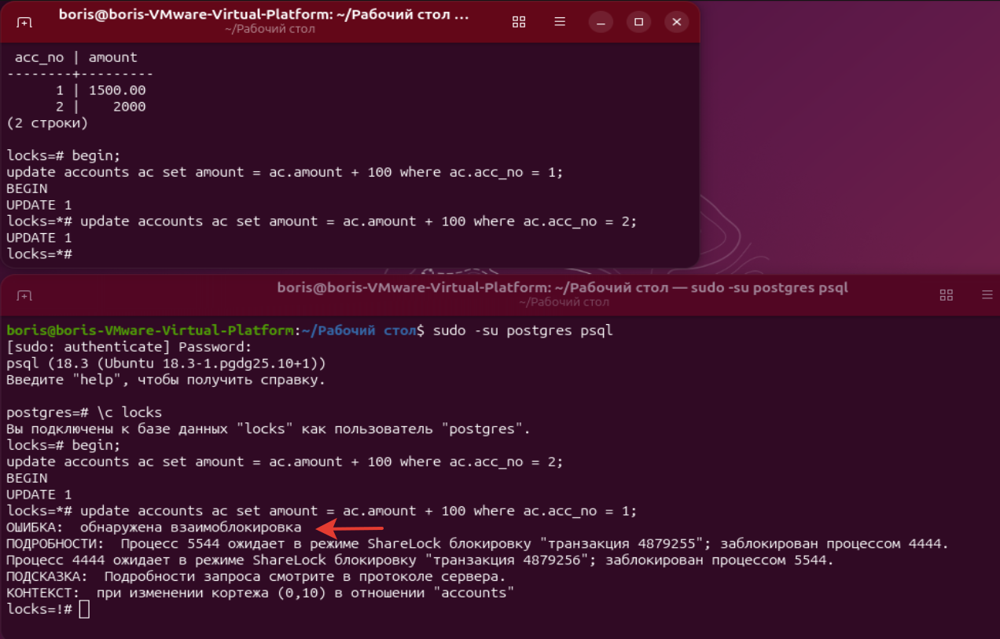
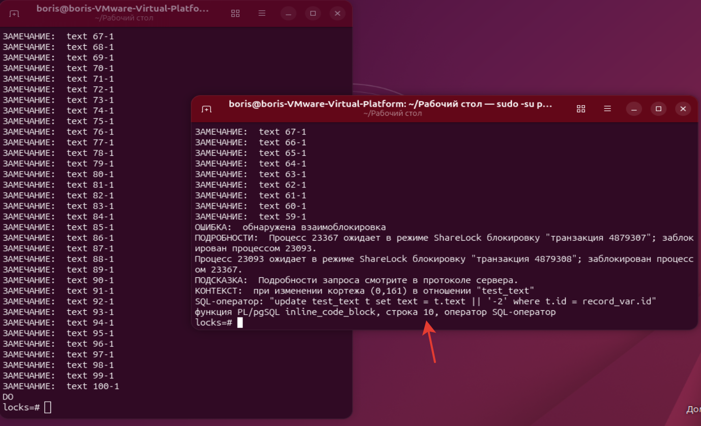

# ДЗ № 8. Блокировки

Зададим параметры логирования блокировок:
```bash
ALTER SYSTEM SET log_lock_waits = on;
ALTER SYSTEM SET deadlock_timeout = '0.2s';
```


Создадим БД, таблицу и строку:
```bash
create database locks;
\c: locks;
CREATE TABLE accounts(
  acc_no integer PRIMARY KEY,
  amount numeric
);
INSERT INTO accounts VALUES (1,1000.00);
```


Запустим 3 сессии с обновлением 1 строки без commit и посмотрим на блокировки:
```bash
BEGIN;
update accounts ac set amount = ac.amount + 100 where ac.acc_no = 1;

SELECT locktype, mode, granted, pid, pg_blocking_pids(pid) AS wait_for
FROM pg_locks WHERE relation = 'accounts'::regclass;
```


Видим блокировки сессий.
После commit'а в первой транзакции вторая сессия провела update,
но третья ещё ожидает окончание транзкции второй сессии:


После commit'а во второй транзакции третья сессия провела update,
блокировок уже нет, то третья транзкция пока не завершена:


Посмотрим сообщения в логе /var/log/postgresql/postgresql-18-main.log:


Тут достаточно подробно описано - кто кого ожидает, в каком режиме блокировки, при каких запросах и на каких таблицах.

Взимная блокировка. Пусть первая транзакция исправит 1-ю строку, вторая - вторую строку, а затем первая сессия - вторую строку, а вторая сессия - первую строку.
Возникнет взаимная блокировка. Postgres должен выявить эту ситуацию и прервать 1 из транзакций.

1-я сессия
```bash
INSERT INTO accounts VALUES (1,1000.00);

begin;
update accounts ac set amount = ac.amount + 100 where ac.acc_no = 1;
```
2-я сессия
```bash
begin;
update accounts ac set amount = ac.amount + 100 where ac.acc_no = 2;
```
1-я сессия
```bash
update accounts ac set amount = ac.amount + 100 where ac.acc_no = 2;
```
2-я сессия
```bash
update accounts ac set amount = ac.amount + 100 where ac.acc_no = 1;
```


Про вопрос в п. 9 можно ответить утвердительно, если 2 сессии при таком update будут выполнять обновление уже изменённых строк в другой сессии.
Воспроизведём это:

```bash
BEGIN;
update accounts ac set amount = ac.amount + 100;
```


Пример взаимной блокировки во встречных циклах.

```sql
create table test_text (id int, text varchar(20));
insert into test_text (id, text) SELECT id, 'text ' || id FROM generate_series(1, 100) id;
```

В первой сессии цикл по возрастанию id:

```sql
DO $$
DECLARE
    curs_name CURSOR FOR SELECT * FROM test_text order by id;
    record_var RECORD;
	i varchar(10);
BEGIN
    FOR record_var IN curs_name LOOP
        -- Обработка строки
        RAISE NOTICE '%', record_var.text;
		update test_text t set text = t.text || '-1' where t.id = record_var.id;
		select pg_sleep(1) into i;
    END LOOP;
END $$;
```

В первой сессии пойдём в цикле обратно по убыванию id:

```sql
DO $$
DECLARE
    curs_name CURSOR FOR SELECT * FROM test_text order by id desc;
    record_var RECORD;
	i varchar(10);
BEGIN
    FOR record_var IN curs_name LOOP
        -- Обработка строки
        RAISE NOTICE '%', record_var.text;
		update test_text t set text = t.text || '-2' where t.id = record_var.id;
		select pg_sleep(1) into i;
    END LOOP;
END $$;
```



Вторая сессия прервалась в обратном цикле при взаимной блокировке.

