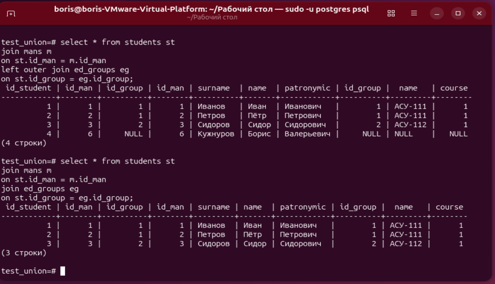
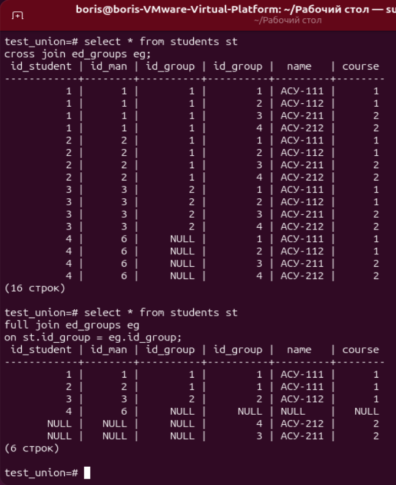

# ДЗ № 9. Выборка данных, виды join'ов. Применение и оптимизация.

Создадим БД, таблицы и заполним данные.

```bash
create database test_union;
\c test_union

```

Таблица людей

```sql
create table mans (id_man integer, surname varchar(100), name varchar(50), patronymic varchar(100));

insert into mans values (1, 'Иванов', 'Иван', 'Иванович');
insert into mans values (2, 'Петров', 'Пётр', 'Петрович');
insert into mans values (3, 'Сидоров', 'Сидор', 'Сидорович');
insert into mans values (4, 'Загорский', 'Геннадий', 'Сергеевич');
insert into mans values (5, 'Лёвин', 'Борис', 'Алексеевич');
insert into mans values (6, 'Кужнуров', 'Борис', 'Валерьевич');
```

Таблица учебных групп

```sql
create table ed_groups (id_group integer, name varchar(10), course integer);
insert into ed_groups values(1, 'АСУ-111', 1);
insert into ed_groups values(2, 'АСУ-112', 1);
insert into ed_groups values(3, 'АСУ-211', 2);
insert into ed_groups values(4, 'АСУ-212', 2);
```

Таблица студентов

```sql
alter table mans add primary key (id_man);
alter table ed_groups add primary key (id_group);

create table students (id_student integer, id_man integer, id_group integer
, foreign key (id_man) references mans(id_man)
, foreign key (id_group) references ed_groups(id_group)
);

alter table students add primary key (id_student);

insert into students values (1, 1, 1);
insert into students values (2, 2, 1);
insert into students values (3, 3, 2);
insert into students values (4, 6);

\pset null 'NULL'
select * from students;

```

Ну а теперь - запросы к таблицам. Вернём список студентов в группах:

```sql
select * from students st
join mans m
on st.id_man = m.id_man
left outer join ed_groups eg
on st.id_group = eg.id_group;
```

Видим, что у студента 4 нет ссылки на учебную группу.
Если взять точное соединение, то в запросе его не будет

```sql
select * from students st
join mans m
on st.id_man = m.id_man
join ed_groups eg
on st.id_group = eg.id_group;
```



cross join даёт декартово произведение всех строк таблиц (необходимо крайне редко в жизни):

```sql
select * from students st
cross join ed_groups eg
```

full join к результату соединения добавляет записи, которым не нашлось соответствия из обеих таблиц (тоже редко нужно в жизни):

```sql
select * from students st
join mans m
on st.id_man = m.id_man
full join ed_groups eg
on st.id_group = eg.id_group;
```


