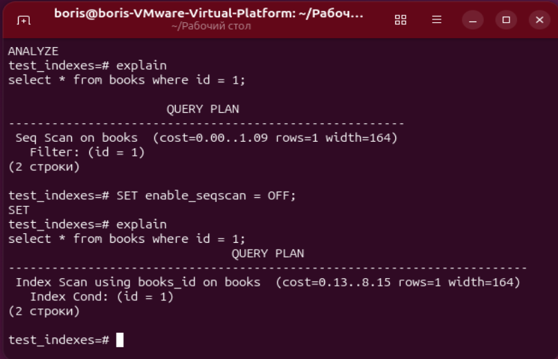
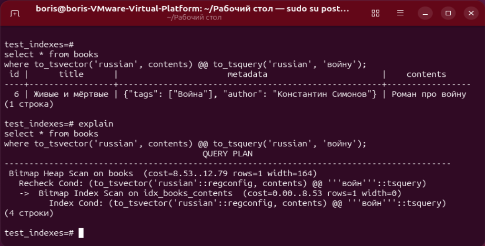
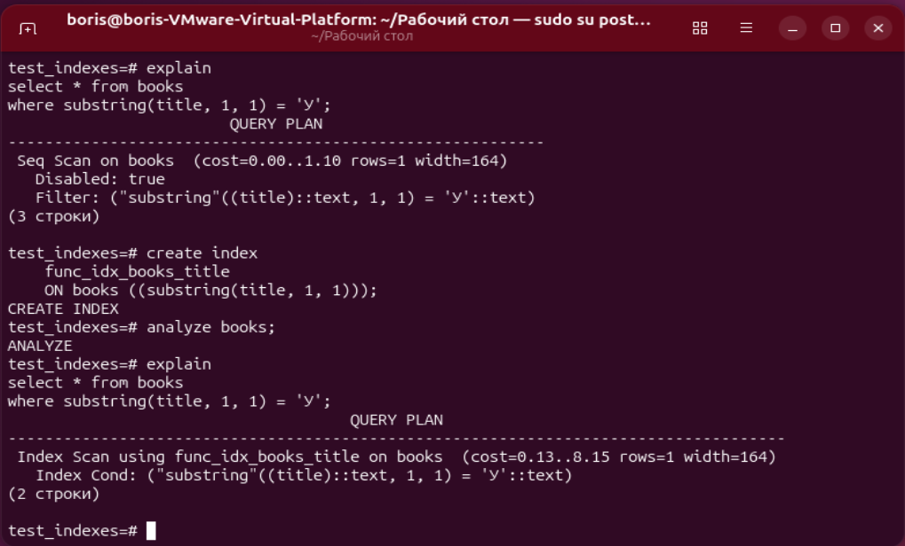
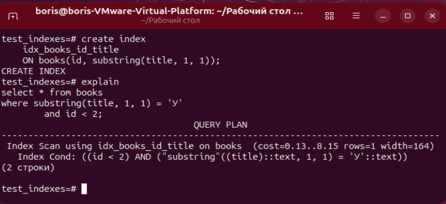

# ДЗ № 10. Работа с индексами

Создадим БД, таблицы и заполним данные.

```postgresql
create database test_indexes;
\c test_indexes

create table books (
    id   integer,
	title    varchar(64),
    metadata jsonb,
    contents text
);

insert into books
    (id, title, metadata, contents)
values
    (1,
      'Ужасы в Афоне',
      '{"author": "Иван Сусанин",  "tags": ["Мистика", "Ужасы"]}',
      'Это книга про страшные истории' ),
    (2,
      'Автобиоргафия',
      '{"author": "Борис Кужнуров",  "tags": ["Биография"]}',
      'Это моя автобиография' ),
    (3,
      'Кладбище домашних животных',
      '{"author": "Стивен Кинг",  "tags": ["Мистика", "Ужасы"]}',
      'Знаменитый роман про воскрешение животных' ),
    (4,
      'Преступление и наказание',
      '{"author": "Фдор Достоевский", "tags": ["Психология"]}',
      'Повесть о самоистезании' ),
    (5,
      'Война и мир',
      '{"author": "Лев Толстой",   "tags": ["О жизни"]}',
      'Летопись 18го века' ),
    (6,
      'Живые и мёртвые',
       '{"author": "Константин Симонов",  "tags": ["Война"]}',
       'Роман про войну' ),
    (7,
      'Стихи',
      '{"author": "Александр Пушкин",  "tags": ["Поэзия"]}',
      'Сборник стихов' );
```

Создадим индекс на поле id:

```postgresql
create index books_id on books(id);
analyze books;
explain
select * from books where id = 1;
```

Индекс не используется, потому что строк в таблице очень мало.
Отключим использование полного сканирования таблицы и посмотрим план выполнения запроса:

```postgresql
SET enable_seqscan = OFF;
explain
select * from books where id = 1;
```

Теперь индекс используется:
                               QUERY PLAN                               
------------------------------------------------------------------------
 Index Scan using books_id on books  (cost=0.13..8.15 rows=1 width=164)
   Index Cond: (id = 1)
(2 строки)



Создадим полнотекстовый индекс на поле contents с помощью GIN индекса:

```postgresql
CREATE INDEX
    idx_books_contents
    ON books
    USING GIN (to_tsvector('russian', contents));

explain
select * from books
where to_tsvector('russian', contents) @@ to_tsquery('russian', 'войну');
```
                                        QUERY PLAN                                        
------------------------------------------------------------------------------------------
 Bitmap Heap Scan on books  (cost=8.53..12.79 rows=1 width=164)
   Recheck Cond: (to_tsvector('russian'::regconfig, contents) @@ '''войн'''::tsquery)
   ->  Bitmap Index Scan on idx_books_contents  (cost=0.00..8.53 rows=1 width=0)
         Index Cond: (to_tsvector('russian'::regconfig, contents) @@ '''войн'''::tsquery)
(4 строки)



Для поиска по 2 словам в функции to_tsquery() необходимо указывать логический оператор И/ИЛИ &/|

```postgresql
select * from books
where to_tsvector('russian', contents) @@ to_tsquery('russian', 'про & войну');
```

Создадим функциональный индекс для размещения книг на полках по алфавиту наименования книги (первая буква из заглавия):

Без индекса используется полное сканирование таблицы:
```postgresql
explain
select * from books
where substring(title, 1, 1) = 'У';
```
                        QUERY PLAN                        
----------------------------------------------------------
 Seq Scan on books  (cost=0.00..1.10 rows=1 width=164)
   Disabled: true
   Filter: ("substring"((title)::text, 1, 1) = 'У'::text)
(3 строки)


```postgresql
create index
    func_idx_books_title
    ON books ((substring(title, 1, 1)));

analyze books;

explain
select * from books
where substring(title, 1, 1) = 'У';
```

                                     QUERY PLAN                                     
------------------------------------------------------------------------------------
 Index Scan using func_idx_books_title on books  (cost=0.13..8.15 rows=1 width=164)
   Index Cond: ("substring"((title)::text, 1, 1) = 'У'::text)
(2 строки)



Здесь мы видим, что стоимость плана выполнения даже больше, чем без использования индекса.
Это связано с тем, что добавляется операция чтения самого индекса, кроме таблицы.
Эффект мы увидим на больших объёмах таблицы в реальных библиотеках.

Теперь создадим индекс на несколько полей.

```postgresql
create index
    idx_books_id_title
    ON books(id, substring(title, 1, 1));

explain
select * from books
where substring(title, 1, 1) = 'У'
	and id < 2;
```

У нас используется составной индекс в запросе при поиске по этим 2 полям:

                                    QUERY PLAN                                    
----------------------------------------------------------------------------------
 Index Scan using idx_books_id_title on books  (cost=0.13..8.15 rows=1 width=164)
   Index Cond: ((id < 2) AND ("substring"((title)::text, 1, 1) = 'У'::text))
(2 строки)


