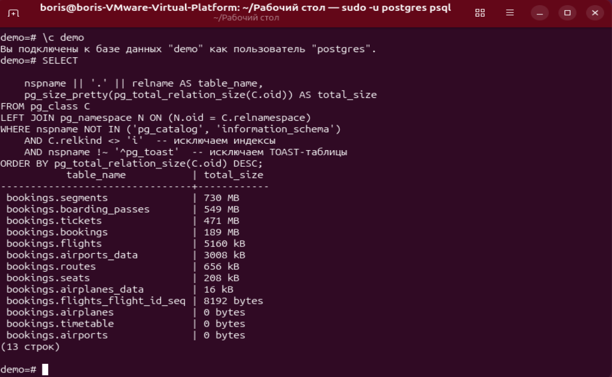
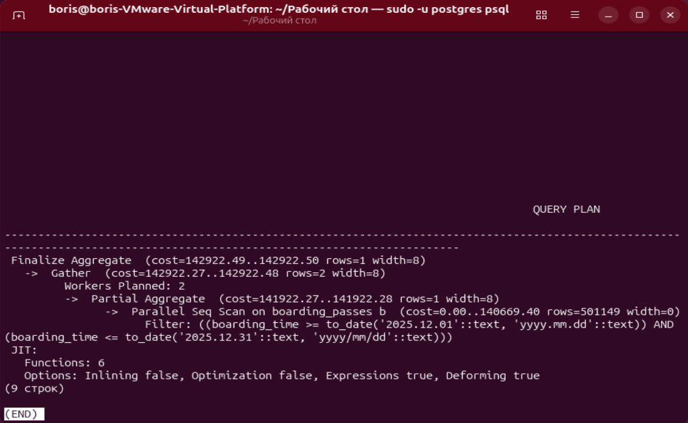
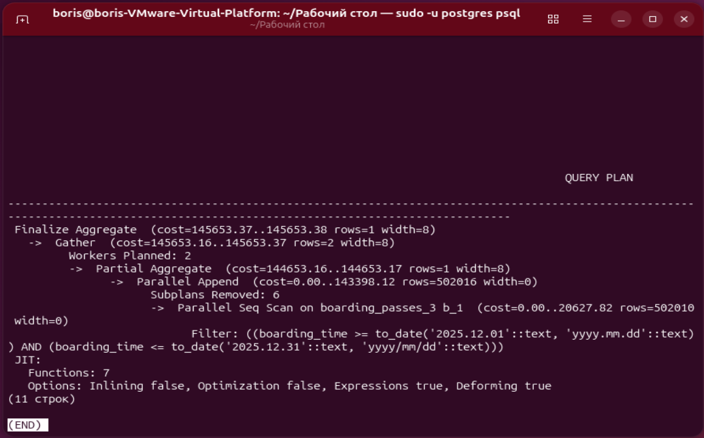

# ДЗ № 11. Секционирование

Смонитируем папку для закачки архива демо-базы

```bash
sudo vmhgfs-fuse .host: /mnt/hgfs -o allow_other -o uid=1000
```

не запускался кластер после изменения прав к папке, восстановить права:
```bash
sudo chmod -R 700 /mnt/data/root/main
```

Разархивируем её в sql-скрипт

```bash
sudo su postgres
cd /mnt/hgfs
gunzip -c demo-20250901-3m.sql.gz > /mnt/hgfs/shared/data.sql
```

Восстановим базу из дампа
```bash
sudo -u postgres psql -d demo -f /mnt/hgfs/shared/data.sql
```

Посмотрим размер таблиц

```bash
\c demo

SELECT
    nspname || '.' || relname AS table_name,
    pg_size_pretty(pg_total_relation_size(C.oid)) AS total_size
FROM pg_class C
LEFT JOIN pg_namespace N ON (N.oid = C.relnamespace)
WHERE nspname NOT IN ('pg_catalog', 'information_schema')
    AND C.relkind <> 'i'  -- исключаем индексы
    AND nspname !~ '^pg_toast'  -- исключаем TOAST-таблицы
ORDER BY pg_total_relation_size(C.oid) DESC;
```



Узнаем диапазон дат посадочных талонов

select min(b.boarding_time), max(b.boarding_time) from bookings.boarding_passes b;
              min              |              max              
-------------------------------+-------------------------------
 2025-10-01 02:32:30.846267+03 | 2026-03-01 02:59:59.536713+03
(1 строка)

Соберём статистику по всем таблицам базы данных
analyze;

Построим план выполнения поиска посадочных талонов за декабрь 2025

explain select count(*)
from bookings.boarding_passes b
where b.boarding_time between to_date('2025.12.01', 'yyyy.mm.dd')
and to_date('2025.12.31', 'yyyy/mm/dd');



Создадим секионирование таблицы посадочных талонов по дате посадки

CREATE TABLE bookings.boarding_passes_all (like bookings.boarding_passes)
PARTITION BY RANGE (boarding_time);

CREATE TABLE bookings.boarding_passes_1 PARTITION OF bookings.boarding_passes_all
FOR VALUES FROM ('2025-10-01') TO ('2025-11-01');

CREATE TABLE bookings.boarding_passes_2 PARTITION OF bookings.boarding_passes_all
FOR VALUES FROM ('2025-11-01') TO ('2025-12-01');

CREATE TABLE bookings.boarding_passes_3 PARTITION OF bookings.boarding_passes_all
FOR VALUES FROM ('2025-12-01') TO ('2026-01-01');

CREATE TABLE bookings.boarding_passes_4 PARTITION OF bookings.boarding_passes_all
FOR VALUES FROM ('2026-01-01') TO ('2026-02-01');

CREATE TABLE bookings.boarding_passes_5 PARTITION OF bookings.boarding_passes_all
FOR VALUES FROM ('2026-02-01') TO ('2026-03-01');

CREATE TABLE bookings.boarding_passes_6 PARTITION OF bookings.boarding_passes_all
FOR VALUES FROM ('2026-03-01') TO ('2026-04-01');

CREATE TABLE bookings.boarding_passes_0 PARTITION OF bookings.boarding_passes_all
DEFAULT;

INSERT INTO bookings.boarding_passes_all SELECT * FROM bookings.boarding_passes;

DROP TABLE bookings.boarding_passes;

ALTER TABLE bookings.boarding_passes_all RENAME TO boarding_passes;

Построим план выполнения н асекционированной таблице

analyze;

explain select count(*)
from bookings.boarding_passes b
where b.boarding_time between to_date('2025.12.01', 'yyyy.mm.dd')
and to_date('2025.12.31', 'yyyy/mm/dd');


