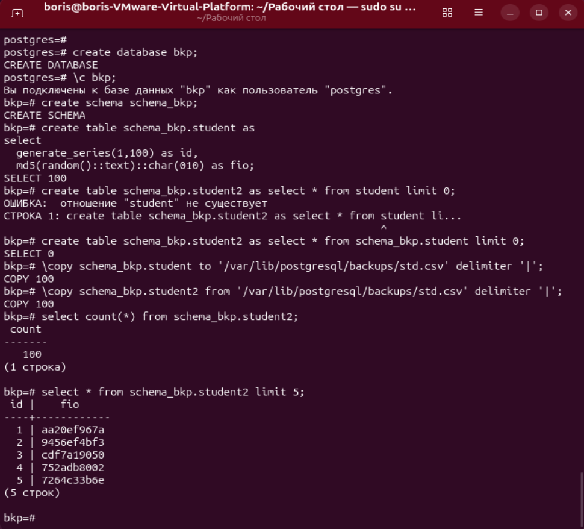

# ДЗ № 13. Бэкапы

Создадим папку для бэкапа

```bash
sudo mkdir -p /var/lib/postgresql/backups/
```

и дадим на неё права пользоватлю postgres

```bash
sudo chown -R postgres:postgres /var/lib/postgresql/backups/
```

Зайдём в postgres
```bash
sudo -u postgres psql
```

Создадим базу данных bkp и перейдём в неё
```postgresql
create database bkp;
\c bkp;
```

Создадим схему данных schema_bkp
```postgresql
create schema schema_bkp;
```

Создадим таблицу студентов в этой схеме данных и сгенерим в неё 100 записей
```postgresql
create table schema_bkp.student as 
select 
  generate_series(1,100) as id,
  md5(random()::text)::char(010) as fio;
```

Создадим вторую таблицу с теми же полями, как и первую, но пустую
```postgresql
create table schema_bkp.student2 as select * from schema_bkp.student limit 0;
```

Выгрузим таблицу student в папку бэкапа
```postgresql
\copy schema_bkp.student to '/var/lib/postgresql/backups/std.csv' delimiter '|';
```

Восстановим из файла записи в таблицу student2
```postgresql
\copy schema_bkp.student2 from '/var/lib/postgresql/backups/std.csv' delimiter '|';
```

Посмотрим таблицу student2
```postgresql
select count(*) from schema_bkp.student2;
select * from schema_bkp.student2 limit 5;
```



pg_dump -n schems_bkp bkp -U postgres -Fc > /var/lib/postgresql/backups/schema_bkp.gz
