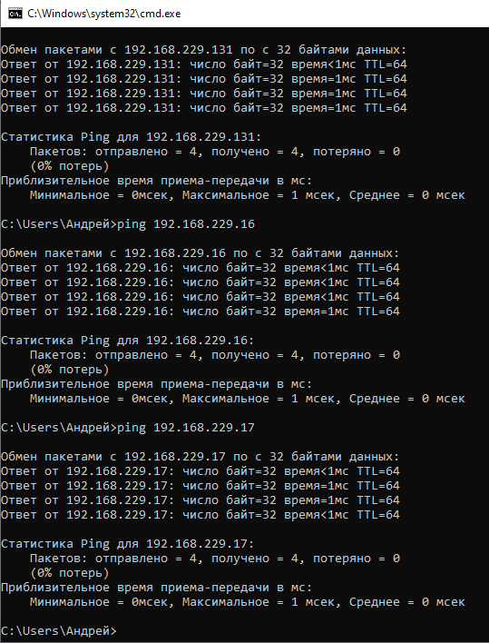
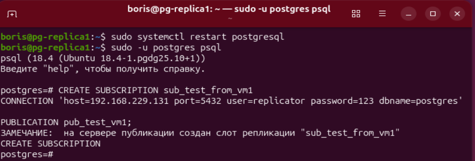
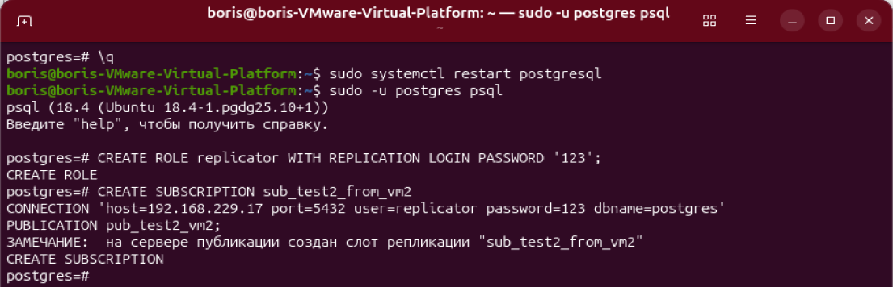
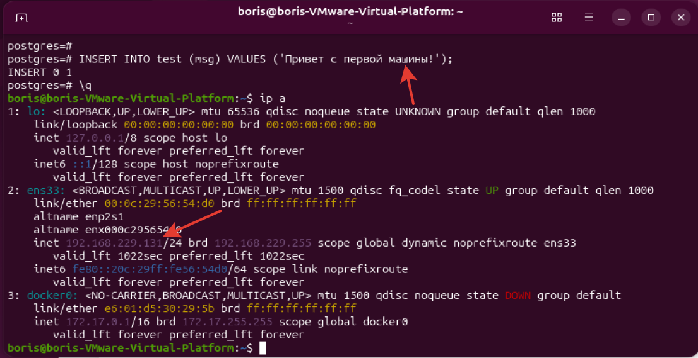
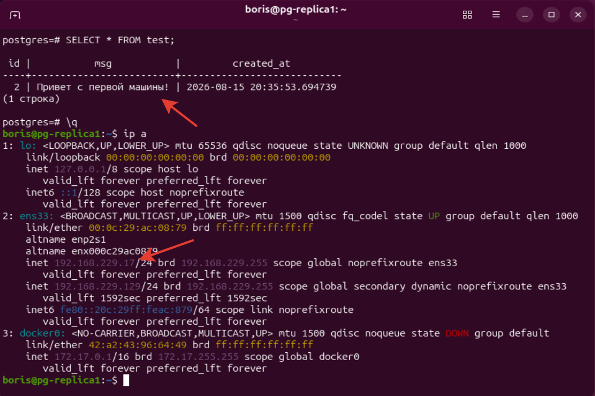
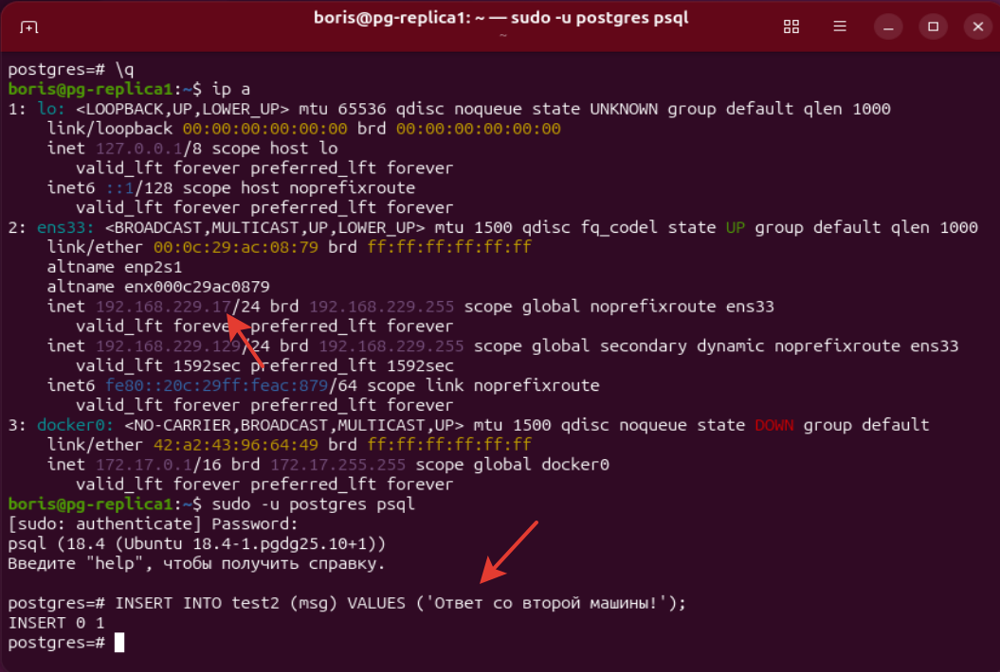
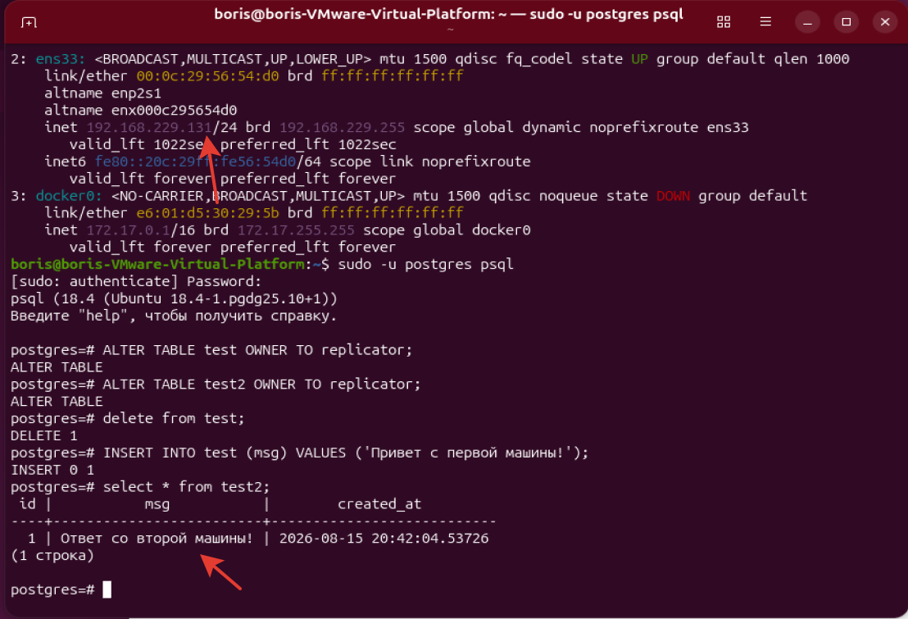
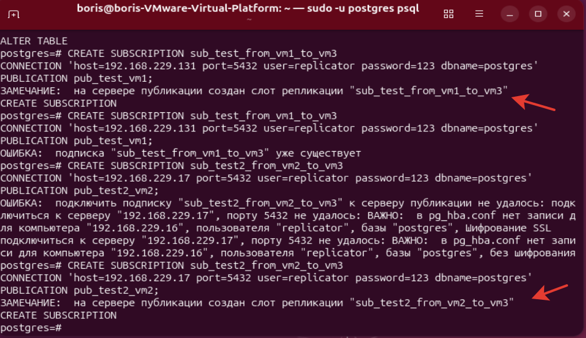
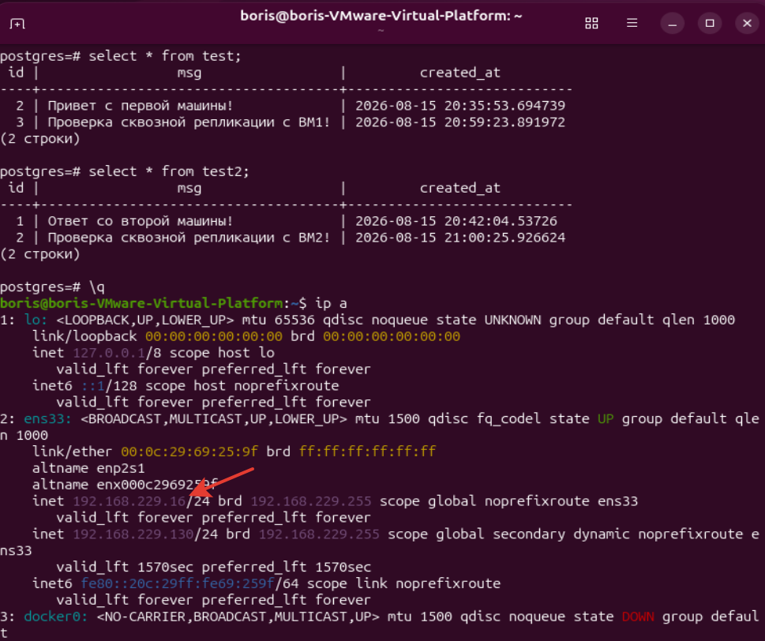
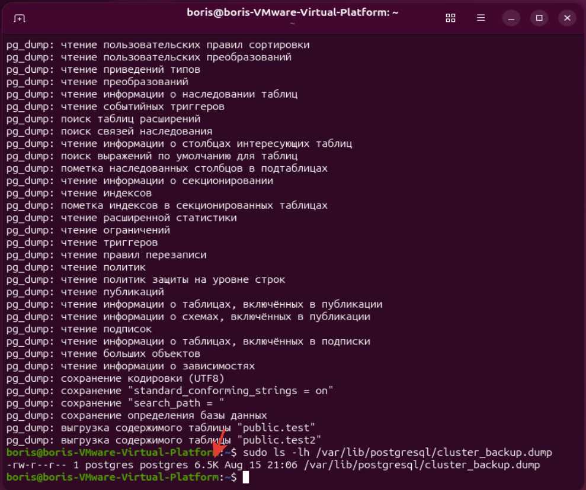

# ДЗ № 14. Репликация

Создадим 2 клона ВМ в vmware.
Поменяем в них адрес в /etc/netplan/00-installer-config.yaml
network:
  version: 2
  renderer: NetworkManager
  ethernets:
    ens33:
      dhcp4: false
      dhcp6: false
      addresses:
        - 192.168.229.17/24
      routes:
        - to: default
          via: 192.168.153.2
      nameservers:
        addresses:
          - 8.8.8.8
          - 8.8.4.4

```bash
sudo netplan apply
sudo hostnamectl set-hostname pg-replica1
```

отключим гашение экрана и его блокировку:
```bash
gsettings set org.gnome.desktop.session idle-delay 0
gsettings set org.gnome.desktop.screensaver lock-enabled false
```

На второй ВМ2 зададим адрес 192.168.229.16/24

Проверим видимость всех 3 машин с windows ноутбука:



На ВМ1 (192.168.229.131) устанавливаем параметр wal_level в режим logical 
/etc/postgresql/18/main/postgresql.conf

Перезапустим postgresql и зайдём в него
```bash
sudo systemctl restart postgresql
sudo -u postgres psql
```

И так - на всех 3 ВМ.


Создадим таблицу
```sql
CREATE TABLE test (
    id SERIAL PRIMARY KEY,
    msg TEXT,
    created_at TIMESTAMP DEFAULT NOW()
);
```

Создаем таблицу test2 (для чтения на ВМ1, куда будут прилетать данные с ВМ2):
```sql
CREATE TABLE test2 (
    id SERIAL PRIMARY KEY,
    msg TEXT,
    created_at TIMESTAMP DEFAULT NOW()
);
```

Создаем публикацию с именем pub_test_vm1:
```sql
CREATE PUBLICATION pub_test_vm1 FOR TABLE test;
```

Проверим
```bash
\dRp+
```

Создаём на ВМ2 и ВМ 3 такие же 2 таблицы.
```sql
CREATE TABLE test (
    id SERIAL PRIMARY KEY,
    msg TEXT,
    created_at TIMESTAMP DEFAULT NOW()
);
CREATE TABLE test2 (
    id SERIAL PRIMARY KEY,
    msg TEXT,
    created_at TIMESTAMP DEFAULT NOW()
);
```
На ВМ2 делаем так:
```sql
CREATE PUBLICATION pub_test2_vm2 FOR TABLE test2;
```

Создадим роль replicator на всех машинах:
```sql
CREATE ROLE replicator WITH REPLICATION LOGIN PASSWORD '123';
```

Создаем подписку на таблицу test с ВМ1
```sql
CREATE SUBSCRIPTION sub_test_from_vm1 
CONNECTION 'host=192.168.229.131 port=5432 user=replicator password=123 dbname=postgres' 
PUBLICATION pub_test_vm1;
```

Получаем ошибку доступа.

На ВМ1 пропишем в /etc/postgresql/18/main/pg_hba.conf адреса:
host	all		all		192.168.229.16/32	scram-sha-256
host	all		all		192.168.229.17/32	scram-sha-256
host    replication     replicator      192.168.229.16/32       scram-sha-256
host    replication     replicator      192.168.229.17/24       scram-sha-256

Перезапустим postgresql
```bash
sudo systemctl restart postgresql
```

На ВМ2 так:
host    all             replicator      192.168.229.131/32      scram-sha-256
host    replication     replicator      192.168.229.131/32      scram-sha-256

Перезапустим postgresql и зайдём в него
```bash
sudo systemctl restart postgresql
sudo -u postgres psql
```

Создаём подписку на ВМ2:
```sql
CREATE SUBSCRIPTION sub_test_from_vm1 
CONNECTION 'host=192.168.229.131 port=5432 user=replicator password=123 dbname=postgres' 
PUBLICATION pub_test_vm1;
```



Создаём подписку на ВМ1 с ВМ2:
```sql
CREATE SUBSCRIPTION sub_test2_from_vm2 
CONNECTION 'host=192.168.229.17 port=5432 user=replicator password=123 dbname=postgres' 
PUBLICATION pub_test2_vm2;
```



На первой ВМ добавляем запись в первую таблицу:
```sql
INSERT INTO test (msg) VALUES ('Привет с первой машины!');
```



Проверим запись в этой таблице на ВМ2:
```sql
SELECT * FROM test;
```

и там пусто!

Теперь дадим права на таблицы пользователю replicator на обеих машинах:
```sql
ALTER TABLE test OWNER TO replicator;
ALTER TABLE test2 OWNER TO replicator;
```

Повторим добавление записи на ВМ1 (предварительно её удалив).
Теперь смотрим таблицу на второй машине:
```sql
SELECT * FROM test;
```



Теперь во второй таблице на ВМ2 добавим строку:
```sql
INSERT INTO test2 (msg) VALUES ('Ответ со второй машины!');
```



И посмотрим запись на ВМ1:
```sql
SELECT * FROM test2;
```




Всё сработало!

Теперь ВМ3 как зеркало.

На ВМ1 и ВМ2 в /etc/postgresql/18/main/pg_hba.conf прописываем:
host    all             replicator      192.168.229.16/32       scram-sha-256

Создаем две подписки на ВМ3:
1. Подписываемся на ВМ1 (.131) для таблицы test:
```sql
CREATE SUBSCRIPTION sub_test_from_vm1_to_vm3
CONNECTION 'host=192.168.229.131 port=5432 user=replicator password=123 dbname=postgres'
PUBLICATION pub_test_vm1;
```

2. Подписываемся на ВМ2 (.17) для таблицы test2:
```sql
CREATE SUBSCRIPTION sub_test2_from_vm2_to_vm3
CONNECTION 'host=192.168.229.17 port=5432 user=replicator password=123 dbname=postgres'
PUBLICATION pub_test2_vm2;
```



На ВМ1 добавим новую запись:
```sql
INSERT INTO test (msg) VALUES ('Проверка сквозной репликации с ВМ1!');
```

На ВМ2 добавим новую запись:
```sql
INSERT INTO test2 (msg) VALUES ('Проверка сквозной репликации с ВМ2!');
```



На ВМ3 выгрузим дамп и проверим его размер:
```bash
sudo -u postgres pg_dump -F c -b -v -f /var/lib/postgresql/cluster_backup.dump postgres
ls -lh /tmp/cluster_backup.dump
```


