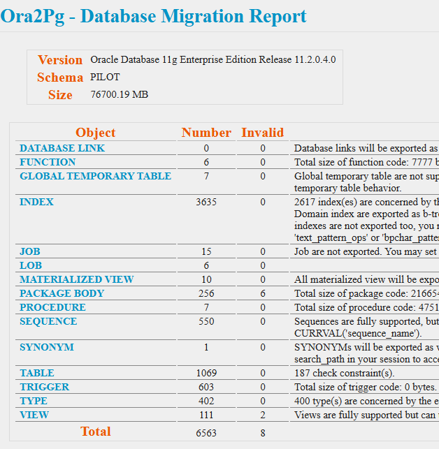
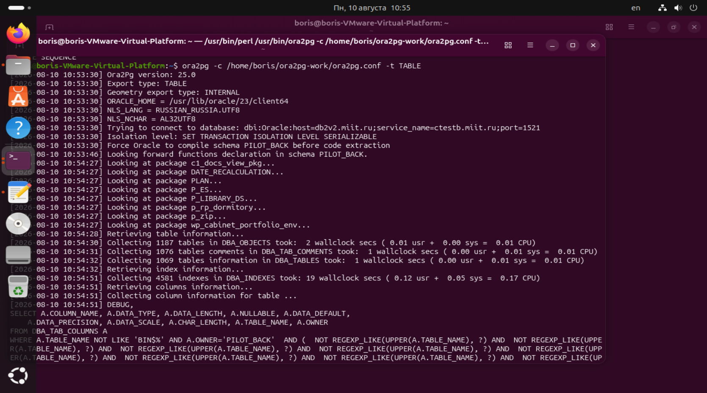

# Проект

Задачи:
1. Установить oracle client и настроить подключение к БД АСУ
2. Установить postgresql
3. Установить perl и развернуть ora2pg
4. Запустить миграцию

Скачаем дистрибутивы oracle client с https://www.oracle.com/database/technologies/instant-client/linux-x86-64-downloads.html

Нужны пакеты:
oracle-instantclient-basic-23.26.3.0.0-1.el10.x86_64.rpm
oracle-instantclient-devel-23.26.3.0.0-1.el10.x86_64.rpm
oracle-instantclient-jdbc-23.26.3.0.0-1.el10.x86_64.rpm
oracle-instantclient-sqlplus-23.26.3.0.0-1.el10.x86_64.rpm

Конвертируем RPM-пакеты в формат DEB с помощью утилиты alien:
```sql
sudo apt-get install alien
sudo alien oracle-instantclient-basic-23.26.3.0.0-1.el10.x86_64.rpm
sudo alien oracle-instantclient-devel-23.26.3.0.0-1.el10.x86_64.rpm
sudo alien oracle-instantclient-jdbc-23.26.3.0.0-1.el10.x86_64.rpm
sudo alien oracle-instantclient-sqlplus-23.26.3.0.0-1.el10.x86_64.rpm
```

Установим пакет libaio1:
sudo apt install -y libaio1t64 libaio-dev libnsl2 libnsl-dev

Теперь нужна символическая ссылка, т.к. пакет в новом ubuntu переименован:
sudo ln -s /usr/lib/x86_64-linux-gnu/libaio.so.1t64 /usr/lib/x86_64-linux-gnu/libaio.so.1

Добавим путь до библиотек клиента Oracle с помощью утилиты ldconfig в список поиска зависимых библиотек и обновим кэш
echo "/lib/oracle/23/client64/lib" > ~/oracle.conf
sudo cp ~/oracle.conf /etc/ld.so.conf.d/

sudo ldconfig

Установим пакеты oracle
sudo dpkg -i oracle-instantclient-*

Пропишем tnsnames.ora
ctestb.miit.ru =
  (DESCRIPTION =
    (ADDRESS = (PROTOCOL = TCP)(HOST = XXXX.miit.ru)(PORT = 1521))
    (LOAD_BALANCE=TRUE)
    (CONNECT_DATA =
      (SERVER = DEDICATED)
      (SERVICE_NAME = XXX.miit.ru)
    )
  )


Запустим sqlplus:
sqlplus pilot/pwd@//XXX.miit.ru:1521/XXX.miit.ru

SELECT owner AS schema_name,
       segment_type,
	   count(*) as cnt,
       ROUND(SUM(bytes) / 1024 / 1024, 2) AS size_mb
FROM dba_segments
WHERE owner = 'PILOT_BACK'
GROUP BY owner, segment_type
ORDER BY size_mb DESC;

SELECT instance_name as SID FROM v$instance;

Выйдем из него и установим perl:
sudo apt install perl

Собираем модули perl.
Начнем с DBD::Oracle для подключения к Oracle
perl -MCPAN -e 'install DBD::Oracle'

Обновим cpan до последне версии:
perl -MCPAN -e 'install Bundle::CPAN && CPAN::Shell->upgrade'

Далее DBI::PG для postgres
sudo apt install libdbd-pg-perl postgresql-plperl-18
sudo apt install libpq-dev
sudo apt install libdbd-pg-perl
perl -MCPAN -e 'install DBD::Pg'

Обновления не проходили, пришлось править публичный DNS на 8.8.8.8 в Netplan
sudo apt update
sudo apt install ora2pg

Создаём директорию:
mkdir -p ~/ora2pg-work

sudo cp /etc/ora2pg/ora2pg.conf ~/ora2pg-work/ora2pg.conf

Пропишем там подключение к oracle, пользователя, пароль, имя схемы
ORACLE_DSN	dbi:Oracle:host=db2v2.miit.ru;sid=ctestb2;port=1521


mkdir -p ~/ora2pg-work/output

Сформируем отчёт (предварительный анализ БД oracle):
ora2pg -c ~/ora2pg-work/ora2pg.conf -t SHOW_REPORT --dump_as_html > ~/ora2pg-work/report.html



Сформируем БД asu и схему pilot в postgres:
CREATE DATA BASE ASU;
\c asu;
CREATE SCHEMA PILOT;
GRANT ALL ON SCHEMA PILOT TO postgres;  -- или ваш пользователь миграции
GRANT ALL ON ALL TABLES IN SCHEMA PILOT TO postgres;


export NLS_LANG=RUSSIAN_CIS.UTF8
ora2pg -c /home/boris/ora2pg-work/ora2pg.conf -t TEST

Создадим пустой файл:
touch /home/boris/ora2pg-work/output/schema_pilot.sql
Сформируем структуру таблиц:
ora2pg -c /home/boris/ora2pg-work/ora2pg.conf -t TABLE



В файле ora2pg.conf переменная
FILE_PER_FKEYS		1
поэтому генерация внешних ключей сформировалась в отдельном файле FKEYS_schema_pilot.sql;.

Триггеры.
Создадим пустой файл:
touch /home/boris/ora2pg-work/output/triggers_pilot.sql
Теперь сгенерируем триггеры (выходной файл без пути, т.к. путь есть в файле конфига, иначе пути склеиваются и получается в пути //)
Ну туповатый ora2pg, что поделать.
ora2pg -c /home/boris/ora2pg-work/ora2pg.conf -t TRIGGER -o triggers_pilot.sql

Последовательности:
Создадим пустой файл:
touch /home/boris/ora2pg-work/output/sequences_pilot.sql
Теперь сгенерируем последовательности:
ora2pg -c /home/boris/ora2pg-work/ora2pg.conf -t SEQUENCE -o sequences_pilot.sql

Значение последовательностей.
Создадим пустой файл:
touch /home/boris/ora2pg-work/output/sequences_value_pilot.sql
Теперь сгенерируем последовательности:
ora2pg -c /home/boris/ora2pg-work/ora2pg.conf -t SEQUENCE_VALUES -o sequences_value_pilot.sql

Представления.
Создадим пустой файл:
touch /home/boris/ora2pg-work/output/views_pilot.sql
Теперь сгенерируем последовательности:
ora2pg -c /home/boris/ora2pg-work/ora2pg.conf -t VIEW -o views_pilot.sql


Загрузим схему в postgres:
psql -h 192.168.229.129 -U postgres -d ASU -f /home/boris/ora2pg-work/output/schema_pilot.sql --set ON_ERROR_STOP=on


psql:schema_pilot.sql:4353: ОШИБКА:  для типа данных smallint не определён класс операторов по умолчанию для метода доступа "gin"
ОШИБКА:  функция lengthb(character varying) не существует - меняем на OCTET_LENGTH

Для повторных запусков генерации схемы просто удаляем всю схему:
DROP SCHEMA IF EXISTS pilot CASCADE;
CREATE SCHEMA pilot;
GRANT ALL ON SCHEMA pilot TO postgres;

psql:schema_pilot.sql:5720: ОШИБКА:  функция uuid_generate_v4() не существует

ora2pg сгенерировал DDL с колонками вида DEFAULT uuid_generate_v4(), а в вашей базе расширение не подключено
Подключаем расширение в postgres:
CREATE EXTENSION IF NOT EXISTS "uuid-ossp";

Уладяем схему и генерируем повторно.

psql:schema_pilot.sql:15425: ОШИБКА:  функция lengthb(character varying) не существует

Заменим LENGTHB() на octet_length() — это аналог в PostgreSQL (1 место такое):
ALTER TABLE portfolio_temp ADD CONSTRAINT check_portf_t_fn CHECK (octet_length(file_name) <= 255);

psql:schema_pilot.sql:23395: ОШИБКА:  ограничение внешнего ключа "fkentrant_$basis_of_training" нельзя реализовать
ПОДРОБНОСТИ:  Столбцы ключа "basis_of_training" ссылающейся таблицы и "idk_basis_training" целевой таблицы имеют несовместимые типы: numeric и bigint.

Когда объектов стало слишком много, пришлось увеличить параметр max_locks_per_transaction в etc/postgresql/18/main/postgresql.conf на 256 и перезапустить postgres^
sudo systemctl restart postgresql

В Oracle типы NUMBER без указания точности/масштаба часто мапятся в PostgreSQL как numeric, а первичные ключи (особенно ID) — как bigint. В результате получается несовместимость для FK.
Вариант исправить типы на уровне маппинга типов в ora2pg глобально меняет все NUMBER → bigint и может не подойти для денег/дробных чисел.
Значит менять типы надо точечно вручную там, где надо.
А их много!
...

Теперь выгрузим данные в файл скрипта:
ora2pg -c /home/boris/ora2pg-work/ora2pg.conf -t COPY

Данные сразу копируются в postgres, потому что в конфиге прописана настройка подключения к нему.

SELECT table_name FROM all_tables WHERE owner = 'PILOT' AND table_name LIKE 'DECL%';

Сгенерируем триггеры в postgres
psql -h 192.168.229.129 -U postgres -d ASU -f /home/boris/ora2pg-work/output/triggers_pilot.sql


Сгенерируем последовательности postgres
psql -h 192.168.229.129 -U postgres -d ASU -f /home/boris/ora2pg-work/output/sequences_pilot.sql
psql -h 192.168.229.129 -U postgres -d ASU -f /home/boris/ora2pg-work/output/sequences_value_pilot.sql

Сгенерируем представления в postgres
psql -h 192.168.229.129 -U postgres -d ASU -f /home/boris/ora2pg-work/output/views_pilot.sql -v ON_ERROR_STOP=0

Заменяем
statement_timestamp() на clock_timestamp()
sed -i 's/statement_timestamp()/clock_timestamp()/g' /home/boris/ora2pg-work/output/views_pilot.sql
